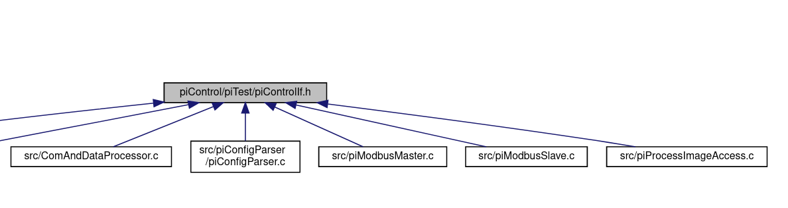

<!--
SPDX-FileCopyrightText: 2023 KUNBUS GmbH

SPDX-License-Identifier: GPL-2.0-or-later
-->

# Input/Output mechanisms
## Configuration

### Slave
This example shows that the Slave (here RTU) gets configured with 32 output and 32 input registers
as well as the communication settings. Both are saved as seperated arrays of two different objects
`inp` and `out`. The rest of the configuration is for piControl.

```json
{
    "GUID": 
    "id": "d
    "type": "VIRTUAL",
    "productType": "24578",
    "position": "64",
    "name": "ModbusRTU Slave",
    "bmk": "ModbusRTU Slave",
    "inpVariant": 0,
    "outVariant": 0,
    "comment": "ModbusRTU Slave",
    "offset": 1237,
    "inp": {
        "0": [
            "Input_1_i05",
            "0",
            "16",
            "0",
            false,
            "0000",
            "",
            ""
        ],
  ...
        "31": [
            "Input_32",
            "0",
            "16",
            "62",
            false,
            "0031",
            "",
            ""
        ]
    },
    "out": {
        "0": [
            "Output_1_i05",
            "0",
            "16",
            "64",
            false,
            "0032",
            "",
            ""
        ],
...
        "31": [
            "Output_32",
            "0",
            "16",
            "126",
            false,
            "0063",
            "",
            ""
        ]
    },
    "mem": {
        "0": [
            "device_path",
            "/dev/ttyUSB0",
            "256",
            "128",
            false,
            "0064",
            "",
            ""
        ],
        "1": [
            "baud_rate",
            "19200",
            "32",
            "160",
            false,
            "0065",
            "",
            ""
        ],
        "2": [
            "parity",
            "1",
            "8",
            "164",
            false,
            "0066",
            "",
            ""
        ],
        "3": [
            "data_bits",
            "8",
            "8",
            "165",
            false,
            "0067",
            "",
            ""
        ],
        "4": [
            "stop_bits",
            "1",
            "8",
            "166",
            false,
            "0068",
            "",
            ""
        ],
        "5": [
            "modbus_address",
            "1",
            "8",
            "167",
            false,
            "0069",
            "",
            ""
        ]
    },
    "extend": {}
}
```

### Master
The next example shows that the Master (here TCP) gets configured with 32 output and 32 input registers,
32 output and 32 input bits, modbus status resets (not mutable), actions status resets (mutable),
master status reset, as well as the communication settings. The action status resets are meant to
configure
[communication timeouts and communication pauses](https://revolutionpi.com/forum/viewtopic.php?t=943),
which is poorly documented.
Inputs of registers and bits are stored in a common array within the `inp` object. The similar `out`
object holds the output registers and bits. The rest of the configuration is for piControl.

```json
{
    "GUID": "4985b9e8-6ff8-8520-9a1c-a93a3bf5444a",
    "id": "device_ModbusTCPMaster_20180122_1_1_001",
    "type": "VIRTUAL",
    "productType": "24579",
    "position": "65",
    "name": "ModbusTCP Master",
    "bmk": "ModbusTCP Master",
    "inpVariant": 0,
    "outVariant": 0,
    "comment": "ModbusTCP Master",
    "offset": 1405,
    "inp": {
        "0": [
            "Input_Word_1",
            "0",
            "16",
            "0",
            false,
            "0000",
            "",
            ""
        ],
...
        "31": [
            "Input_Word_32",
            "0",
            "16",
            "62",
            false,
            "0031",
            "",
            ""
        ],
        "32": [
            "Input_Bit_1",
            "0",
            "1",
            "64",
            false,
            "0032",
            "",
            "0"
...
        "63": [
            "Input_Bit_32",
            "0",
            "1",
            "64",
            false,
            "0063",
            "",
            "31"
        ],
        "64": [
            "Modbus_Action_Status_1",
            "255",
            "8",
            "68",
            false,
            "0064",
            "",
            ""
        ],
...
        "96": [
            "Modbus_Master_Status",
            "255",
            "8",
            "100",
            false,
            "0096",
            "",
            ""
        ]
    },
    "out": {
        "0": [
            "Output_Word_1",
            "0",
            "16",
            "101",
            false,
            "0097",
            "",
            ""
        ],
...
        "31": [
            "Output_Word_32",
            "0",
            "16",
            "163",
            false,
            "0128",
            "",
            ""
        ],
        "32": [
            "Output_Bit_1",
            "0",
            "1",
            "165",
            false,
            "0129",
            "",
            "0"
        ],
...
        ],
        "63": [
            "Output_Bit_32",
            "0",
            "1",
            "165",
            false,
            "0160",
            "",
            "31"
        ],
        "64": [
            "Action_Status_Reset_1",
            "0",
            "1",
            "169",
            false,
            "0161",
            "",
            "0"
        ],
...
        "95": [
            "Action_Status_Reset_32",
            "0",
            "1",
            "169",
            false,
            "0192",
            "",
            "31"
        ],
        "96": [
            "Master_Status_Reset",
            "0",
            "8",
            "173",
            false,
            "0193",
            "",
            ""
        ]
    },
    "mem": {
        "0": [
            "slave_IP_address",
            "192.168.0.10",
            "128",
            "174",
            false,
            "0194",
            "",
            ""
        ],
        "1": [
            "slave_TCP_port",
            "502",
            "16",
            "190",
            false,
            "0195",
            "",
            ""
        ]
    },
    "extend": {}
}
```

## Operation
### Process Image
The modbus module relies heavily on its piControl submodule.
It depends on `piTest/piControlIf.h` and the modules functions

  * piControlSetBitValue
  * piControlGetBitValue
  * piControlWrite
  * piControlRead
  * piControlWaitForEvent

The access is concentrated mostly within the file `ComAndDataProcessor.c` and lesser `piProcessImageAccess.c`,
but there are also a few calls from `piConfigParser/piConfigParser.c`, `piModbusSlave.c`, and `piModbusMaster.c`
which could and should be hidden away behind an interface.



### Modbus protocol
The protocol is provided by [libmodbus](https://libmodbus.org/).
The functions aren't accessed through a defined interface but forwarded
by `ComAndDataProcessor.h` into two files (for now) and called directly. This causes issues with changes in
libmodbus' API, apparently already an issue in the past and handled by the pre-processor via
`LIBMODBUS_VERSION_CHECK` macro.

For each and every instance of a modbus device there is a new thread started within the `Scheduler` module.
The full functionality like coils and holding registers currently are supported by the function
`processModbusAction` from the `ComAndDataProcessor` module, which is used by the modbus *master*.

The slave on the other hand is limited by the functionality of
[libmodbus mapping](https://libmodbus.org/docs/v3.1.7/modbus_mapping_new.html).
libmodbus provides following types which could be used with slave/server communication:

  * bits
  * input_bits
  * registers
  * input_registers

`piConfigParser.c` does only configure/read input and holding registers for the time being.
